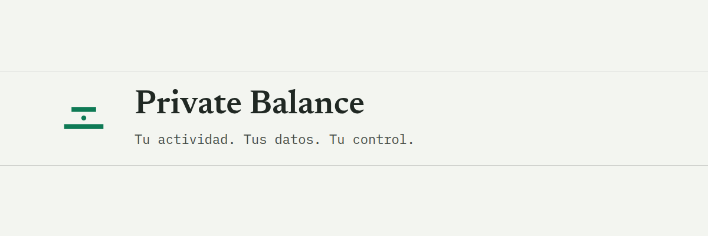

<div align="center">

<picture>
  <source media="(prefers-color-scheme: dark)" srcset="docs/assets/banner-dark.png">
  <source media="(prefers-color-scheme: light)" srcset="docs/assets/banner-light.png">
  
</picture>

# Private Balance

Aplicación financiera privada y local-first para profesionales independientes y pequeños negocios: ingresos, gastos, agenda, temporadas, reportes, licencias y copias de seguridad, con los datos financieros siempre en el dispositivo del usuario.

[](https://react.dev)
[](https://www.typescriptlang.org)
[](https://vitejs.dev)
[](https://tailwindcss.com)
[](https://capacitorjs.com)


[Documentación](docs/README.md) · [Arquitectura](docs/00_SYSTEM_ARCHITECTURE_MASTER.md) · [Privacidad](docs/PRIVACY.md) · [Seguridad](SECURITY.md) · [Contribuir](CONTRIBUTING.md) · [Guía para agentes IA](AGENTS.md)

</div>

---

## Tabla de contenidos

- [Vista general](#vista-general)
- [Estado del proyecto](#estado-del-proyecto)
- [Características](#características)
- [Privacidad](#privacidad)
- [Capturas](#capturas)
- [Arquitectura](#arquitectura)
- [Tecnologías](#tecnologías)
- [Inicio rápido](#inicio-rápido)
- [Pruebas](#pruebas)
- [PWA y Android](#pwa-y-android)
- [Documentación](#documentación)
- [Roadmap](#roadmap)
- [Contribución](#contribución)
- [Seguridad](#seguridad)
- [Licencia](#licencia)
- [Autor](#autor)

---

## Vista general

Private Balance permite registrar ingresos por servicios, gastos operativos, ajustes, citas de agenda y temporadas de trabajo, y generar reportes exportables, manteniendo el núcleo financiero funcionando **sin conexión** y sin depender de un backend propio para el uso diario.

El proyecto está pensado para quien necesita:

- Llevar el control de su actividad financiera sin subir sus datos a un servidor de terceros por defecto.
- Trabajar en modo Básico (simple) o Profesional (con temporadas y cierres) según el tipo de negocio.
- Usar la misma aplicación en navegador, como PWA instalable o como app Android empaquetada con Capacitor.
- Activar, de forma opcional y explícita, automatización, mensajería y un asistente conversacional con IA sin perder el control de los datos financieros.

Lo diferencia frente a una hoja de cálculo o una app financiera genérica es esa combinación: reglas de negocio explícitas y documentadas (ver la [Constitución técnica](docs/PRIVATE_BALANCE_CONSTITUTION.md)), persistencia local verificable y una capa de integraciones externas que es siempre opcional y aislada del dominio.

## Estado del proyecto

Private Balance está en **desarrollo activo**, no en versión estable publicada. El estado por área, verificado contra el código fuente:

| Área | Estado | Notas |
|---|---|---|
| Ingresos, gastos, ajustes, agenda | Implementado | `src/pages`, `src/services`, `src/database` |
| Modo Básico / Profesional y temporadas | Implementado | reglas en `docs/PRIVATE_BALANCE_CONSTITUTION.md` |
| Persistencia local (Dexie/IndexedDB) | Implementado | `src/database`, migraciones versionadas |
| Reportes y exportación (PDF, CSV, XLS) | Implementado | `src/services/incomeExportService.ts`, jsPDF |
| PIN y bloqueo de acceso | Implementado | hash con sal, bloqueo por inactividad/segundo plano |
| Licencias firmadas por dispositivo (V2) | Implementado | ECDSA P-256, ver [SECURITY.md](SECURITY.md) |
| Backup cifrado a Google Drive (appDataFolder) | Implementado | AES-GCM en cliente antes de subir |
| Android vía Capacitor | Implementado | `android/`, R8/ProGuard en release |
| Web App instalable (manifest + iconos) | Parcial | manifest e iconos activos; **sin** service worker/caché offline (`vite-plugin-pwa` no está registrado en `vite.config.ts`) |
| Automatización con n8n / Vercel Functions | Implementado, con riesgos abiertos | ver [docs/AUTOMATION_HUB.md](docs/AUTOMATION_HUB.md) y [docs/04_N8N_WORKFLOWS.md](docs/04_N8N_WORKFLOWS.md) |
| Canal WhatsApp (Evolution API) | Implementado, con riesgos operativos | orquestado vía n8n, nunca directo desde el cliente |
| Asistente conversacional con IA | Implementado (foundational) | resolución de intención determinista + proveedor OpenAI real opcional vía proxy servidor; ver [docs/09_AI_CORE_ARCHITECTURE.md](docs/09_AI_CORE_ARCHITECTURE.md) |
| Sincronización multidispositivo cifrada | Planificado | ver [docs/00_SYSTEM_ARCHITECTURE_MASTER.md](docs/00_SYSTEM_ARCHITECTURE_MASTER.md) |
| Integración continua (CI) | No implementado | no existe `.github/workflows` en este repositorio |

Esta tabla resume el estado a alto nivel. El detalle completo y verificado por milestone vive en [docs/00_SYSTEM_ARCHITECTURE_MASTER.md](docs/00_SYSTEM_ARCHITECTURE_MASTER.md) y [docs/context/CURRENT_STATE.md](docs/context/CURRENT_STATE.md).

## Características

- **Inicio y Resumen**: resumen mensual simplificado y vista de indicadores/métricas detalladas.
- **Ingresos**: registro de servicios con conversión de moneda, control de reporte (`pendiente`/`reportado`) y exportación. Método de cálculo configurable por método Strategy (`src/utils/incomeCalculation/`): "Servicio por tiempo" (duración + % de temporada, con cronómetro) o "Jornada por horas" (tiempo trabajado × valor por hora, sin cronómetro ni % de temporada), más Adicionales (importes extra sobre el ingreso principal).
- **Gastos**: registro de gastos operativos por categoría, con ajustes diferenciados de gasto normal.
- **Agenda**: citas convertibles en ingresos, con temporización.
- **Temporadas**: cierres y periodos del modo Profesional con detalle histórico.
- **Reportes**: exportación a PDF, CSV y XLS (formato SpreadsheetML generado sin dependencias de terceros con vulnerabilidades conocidas).
- **Insights**: panel de indicadores financieros derivados de los datos locales (modo Profesional).
- **Conversación con IA**: asistente que responde preguntas financieras sobre los datos locales usando herramientas deterministas, con proveedor OpenAI real opcional y respaldo determinista si la IA no está disponible.
- **Seguridad**: PIN local con hash y sal, bloqueo por inactividad y al pasar a segundo plano.
- **Licencias**: activación firmada digitalmente y vinculada al dispositivo.
- **Backup**: exportación/importación cifrada local y backup automático opcional a Google Drive (`appDataFolder`).
- **Automatización**: eventos de ingreso/gasto/agenda enviados de forma opcional a un flujo n8n a través de un proxy propio, sin exponer credenciales en el cliente.
- **Android**: empaquetado con Capacitor, con ofuscación R8/ProGuard en los builds de release.

## Privacidad

Resumen; el detalle completo está en [docs/PRIVACY.md](docs/PRIVACY.md).

- Los datos financieros (ingresos, gastos, agenda, temporadas, reportes) se almacenan localmente en IndexedDB mediante Dexie. No existe un backend propio que los reciba para el uso diario.
- La conversión de moneda consulta la API pública de Frankfurter (`api.frankfurter.dev`) directamente desde el cliente; solo se envían los códigos de moneda y la fecha necesarios para la tasa, no datos financieros del usuario.
- Si el usuario activa el asistente conversacional con IA y hay un proveedor real configurado, el mensaje del usuario y el contexto financiero estructurado necesario para responder se envían a través de un proxy propio hacia OpenAI. Sin esa activación explícita, la conversación usa resolución determinista local sin salir del dispositivo.
- Si el usuario activa Automatización (n8n) o el canal WhatsApp, los eventos correspondientes (ingreso, gasto, cita creados) salen del dispositivo hacia un proxy propio y de ahí a n8n/Evolution API. Estas integraciones están desactivadas hasta que el usuario las configura.
- El backup a Google Drive solo usa el scope `drive.appdata` (carpeta privada de la app) y cifra los datos con AES-GCM en el dispositivo antes de subirlos; el JSON plano nunca sale sin cifrar por esta vía.
- Las licencias no se incluyen en los backups financieros, para evitar transferir una activación entre dispositivos.

No se afirma privacidad absoluta: existen integraciones externas opcionales y, una vez activadas, implican tránsito de datos fuera del dispositivo bajo el control explícito del usuario.

## Capturas

Aún no hay capturas reales incorporadas al repositorio. La guía para generarlas con datos ficticios está en [docs/assets/screenshots/README.md](docs/assets/screenshots/README.md).

## Arquitectura

```text
React + Capacitor + IndexedDB/Dexie   (dominio financiero local, fuente de verdad)
        |
        | outbox de automatización (opcional)
        v
Vercel Functions (/api/*)             (validación de licencia, JWT temporal, proxy)
        |
        v
n8n --> Neon PostgreSQL / Evolution API (WhatsApp)
```

Resumen de capas:

- **Interfaz y estado**: React 19 + React Router, Zustand y Context API según el caso, formularios con React Hook Form + Zod.
- **Persistencia local**: Dexie sobre IndexedDB, con migraciones versionadas (`src/database/migrations`).
- **Servicios de dominio**: `src/services` (ingresos, gastos, licencias, backup, exportación, moneda).
- **Inteligencia/IA**: `src/intelligence` — resolución de intención, herramientas financieras de solo lectura, motor de insights y planificación, capa de coaching conversacional, todo provider-neutral y desacoplado de OpenAI.
- **Backend ligero**: `api/` (Vercel Functions) y `server/` (utilidades, cliente Neon, seguridad de automatización).
- **PWA/Android**: manifest web instalable + empaquetado Android vía Capacitor.

El detalle completo, con límites, decisiones (ADR) y deuda técnica conocida, está en [docs/00_SYSTEM_ARCHITECTURE_MASTER.md](docs/00_SYSTEM_ARCHITECTURE_MASTER.md) y [docs/architecture/](docs/architecture/).

## Tecnologías

Verificadas en `package.json` y en el código fuente:

- React 19, React Router 7, TypeScript 6 (estricto), Vite 8.
- Tailwind CSS 4.
- Zustand, React Hook Form, Zod.
- Dexie 4 sobre IndexedDB.
- Capacitor 8 (Android, notificaciones locales, filesystem, share, preferences).
- jsPDF + jspdf-autotable para exportación PDF.
- html2canvas para exportación/compartido de reportes (`src/services/reportShareService.ts`), declarado como dependencia directa.
- OpenAI SDK, consumido únicamente desde el proxy servidor (`api/ai-provider-openai.ts`), nunca desde el cliente.
- `@neondatabase/serverless` para el backend ligero de licencias/dispositivos/canales.
- Vitest para pruebas.
- ESLint + typescript-eslint.

## Inicio rápido

Requisitos: Node.js compatible con Vite 8 y npm.

```bash
git clone https://github.com/Orpira/finance-app.git
cd finance-app
npm install
cp .env.example .env.local   # completar según docs/AUTOMATION_HUB.md si se usará automatización
npm run dev
```

La app queda disponible en `http://localhost:5173`.

Compilación de producción:

```bash
npm run build
```

Variables de entorno: ver [.env.example](.env.example) para el cliente y `api`/`server` para las exclusivas de servidor. Ninguna variable con prefijo `VITE_` puede contener secretos de automatización; `vite.config.ts` hace fallar el build si detecta una.

## Pruebas

```bash
npm run test              # Vitest, suite unitaria/integración (test/ y tests/)
npm run test:indexeddb    # pruebas de migración Dexie en un navegador real
npm run lint               # ESLint
```

La suite de Vitest es extensa (más de cien archivos de prueba) y cubre principalmente los dominios de IA/conversación, insights, licencias y automatización. No existe pipeline de integración continua configurado en este repositorio: las pruebas se ejecutan localmente antes de cada cambio relevante.

## PWA y Android

- **Web/PWA**: `public/manifest.webmanifest` e iconos están activos y la app es instalable, pero **no** hay un service worker registrado (`vite-plugin-pwa` es una dependencia presente pero no está conectado en `vite.config.ts`); no hay caché de assets ni uso completo offline garantizado por un service worker propio.
- **Android**: empaquetado con Capacitor (`capacitor.config.ts`, `android/`). Comandos: `npm run android:add`, `npm run android:sync`, `npm run android:open`, `npm run android:apk`. Los builds de release usan R8/ProGuard (`minifyEnabled`, `shrinkResources`).

Detalle adicional en [docs/08_DEPLOYMENT.md](docs/08_DEPLOYMENT.md).

## Documentación

| Documento | Contenido |
|---|---|
| [docs/README.md](docs/README.md) | Índice documental completo |
| [docs/PRIVATE_BALANCE_CONSTITUTION.md](docs/PRIVATE_BALANCE_CONSTITUTION.md) | Reglas de negocio y principios técnicos, fuente principal de verdad |
| [docs/00_SYSTEM_ARCHITECTURE_MASTER.md](docs/00_SYSTEM_ARCHITECTURE_MASTER.md) | Mapa integral de arquitectura, estado y roadmap |
| [docs/PRIVACY.md](docs/PRIVACY.md) | Privacidad: qué datos salen del dispositivo y cuándo |
| [docs/architecture/11_SECURITY.md](docs/architecture/11_SECURITY.md) | Modelo de seguridad técnico detallado |
| [docs/AUTOMATION_HUB.md](docs/AUTOMATION_HUB.md) | Contrato de automatización app → Vercel → n8n |
| [docs/MANUAL_USUARIO.md](docs/MANUAL_USUARIO.md) | Guía de uso funcional |
| [AGENTS.md](AGENTS.md) | Guía para agentes de IA y nuevos colaboradores |
| [CONTRIBUTING.md](CONTRIBUTING.md) | Cómo contribuir |
| [SECURITY.md](SECURITY.md) | Cómo reportar una vulnerabilidad |

## Roadmap

Resumen de fases activas y siguientes; el detalle vivo está en [docs/03_ROADMAP_MASTER.md](docs/03_ROADMAP_MASTER.md) y [docs/context/ROADMAP.md](docs/context/ROADMAP.md).

- **En progreso**: consolidación del asistente conversacional con IA (herramientas financieras, coaching proactivo) y control de ingresos reportados.
- **Planificado**: sincronización multidispositivo cifrada, hardening de auditoría de workflows n8n, checklist formal de seguridad para release.
- **En evaluación**: activación de Play Integrity API con verificación en servidor propio.

## Contribución

Ver [CONTRIBUTING.md](CONTRIBUTING.md) para el flujo de ramas, convención de commits y checklist antes de proponer un cambio.

## Seguridad

Para reportar una vulnerabilidad, ver [SECURITY.md](SECURITY.md). Para el modelo de seguridad técnico implementado, ver [docs/architecture/11_SECURITY.md](docs/architecture/11_SECURITY.md).

## Licencia

Este repositorio no incluye actualmente un archivo de licencia formal. El uso, copia o distribución del código está sujeto a la autorización del propietario hasta que se publique una licencia formal.

## Autor

 **Orlando Pineda** — OrPiRa.

---

<sub>Este README describe el estado verificado del código al momento de su redacción. Si algo aquí no coincide con el comportamiento real de la aplicación, prevalece el código y agradecemos que se abra un issue.</sub>
