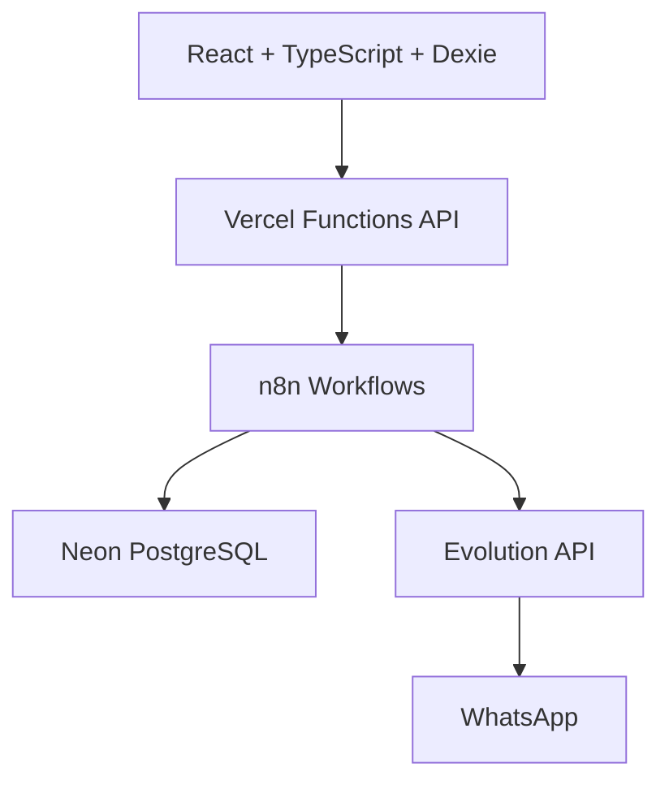
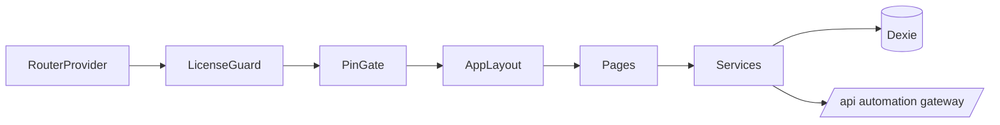
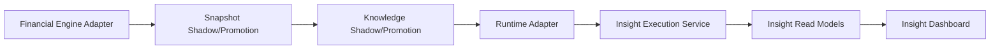

# 01 - Architecture

## 1) Vista global por capas

## 2) Fronteras técnicas

### Capa Cliente

Responsabilidades:

- UI y navegación.
- Persistencia financiera local.
- Outbox de automatización.
- Guardias de licencia/PIN/modo de uso.
- Integración de dashboard de insights.

No debe hacer:

- llamadas directas a Evolution API;
- gestión de secretos de n8n;
- escritura directa en Neon.

### Capa Serverless (`api/*` + `server/*`)

Responsabilidades:

- validar payloads con Zod;
- validar licencia firmada y vínculo dispositivo;
- emitir/verificar JWT temporal para gateway;
- enrutar eventos a n8n por tipo;
- resolver comunicación contextual por `deviceCode -> userCode -> communication_channels`.

No debe hacer:

- lógica financiera de dominio que ya existe en cliente;
- exposición de secretos al frontend.

### Capa Automatización (n8n)

Responsabilidades:

- recibir webhooks del gateway;
- aplicar idempotencia de infraestructura (`processed_events`);
- orquestar acciones de provisión y comunicación;
- interactuar con Evolution y Neon.

No debe hacer:

- redefinir balance financiero canónico;
- depender de selección global de canal por recencia.

### Capa Persistencia Remota (Neon)

Responsabilidades:

- licencias y dispositivos autorizados;
- estado y metadatos de canales de comunicación;
- soporte de idempotencia/eventos procesados en workflows.

## 3) Arquitectura de aplicación en cliente

## 4) Pipeline AI Foundation implementado

- La fuente oficial financiera sigue siendo legacy por defecto.
- Los pilotos se activan solo por feature flags exactos.
- Todo flujo es fail-closed y con fallback seguro.

## 5) Contratos de integración críticos

- `api/automation-token`: licencia V2 -> JWT corto.
- `api/automation`: envelope validado + dispatch por evento.
- `api/communication-channel`: lectura contextual de canal conectado.
- `api/license-activate`: autorización de dispositivo por licencia.

## 6) Invariantes arquitectónicos

- `financialSnapshots` y `knowledgeSnapshots` no reemplazan libro operativo.
- Los resets/imports de base local no deben borrar auditoría append-only.
- Los workflows críticos deben responder webhook de manera explícita.
- Cualquier falla de frontera debe degradar con respuesta controlada.

## 7) Límites de evolución recomendados

- Cambios de estructura de datos: migración explícita + prueba de regresión.
- Cambios de contrato API: versionado y validación backward compatibility.
- Cambios de workflows: auditoría de ramas sin `Respond to Webhook`.
- Cambios AI Foundation: mantener legacy como autoridad hasta ADR de corte.
