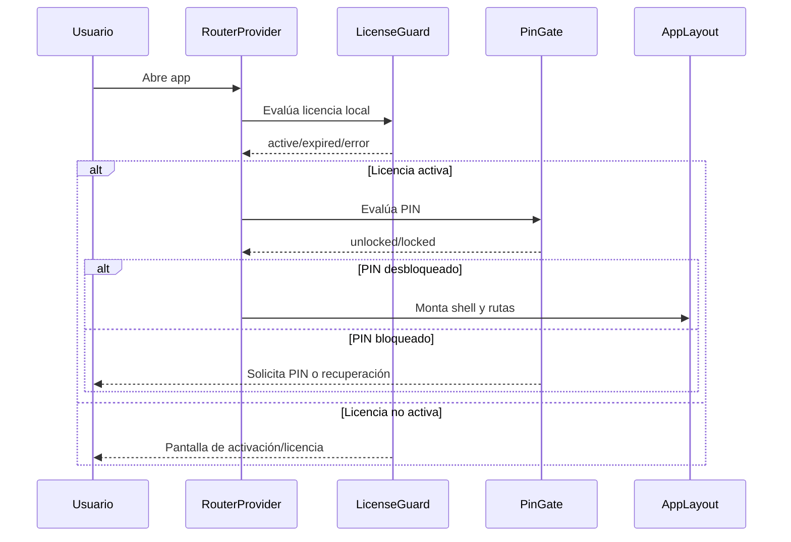
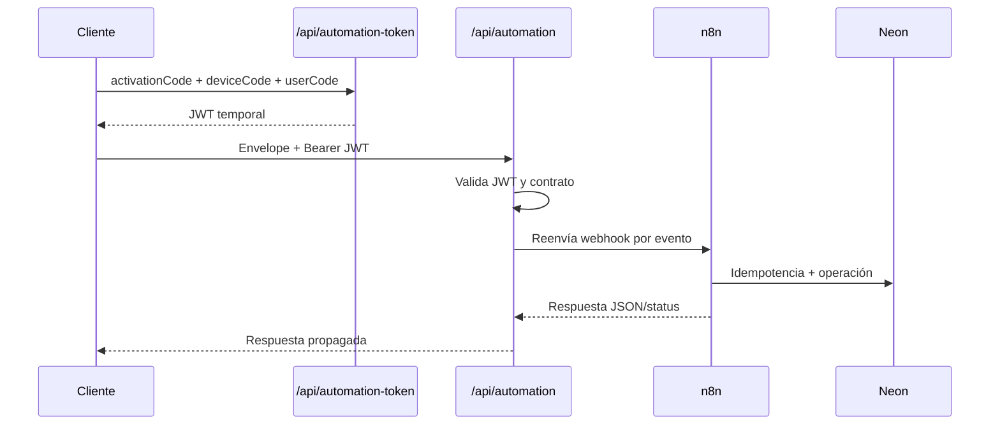

# 04 - Application Flow

## 1) Flujo de arranque y acceso

## 2) Flujo financiero local (ingreso/egreso)

1. UI captura formulario.
2. Servicio normaliza datos y persiste en Dexie.
3. En misma transacción, se crea evento en `automationOutbox`.
4. UI refleja resultado local inmediato.
5. Outbox despacha de forma asíncrona hacia gateway.

## 3) Flujo de automatización

## 4) Flujo de comunicación WhatsApp

1. usuario solicita conexión desde configuración;
2. evento `device.whatsapp.connect.requested` llega a gateway;
3. gateway enruta a workflow WhatsApp;
4. workflow gestiona instancia Evolution;
5. estado/canal se persiste en Neon;
6. cliente consulta estado por `api/communication-channel`.

## 5) Flujo Home con AI Foundation

1. Home calcula balance legacy local.
2. Adapter financiero ejecuta cálculo determinista.
3. Validación de paridad (shadow) según flags.
4. Snapshot shadow/promotion opcional.
5. Knowledge shadow/promotion opcional.
6. Resultado oficial mantiene fallback fail-closed.

## 6) Flujo Dashboard Insights (7F)

1. Ruta profesional `/dashboard`.
2. Controller ejecuta `InsightExecutionService`.
3. Resultado se proyecta por `InsightReadModels`.
4. UI renderiza estado discriminado: `loading`, `success`, `empty`, `rejected`, `error`.
5. Reintento manual sin duplicación durante carga.

## 7) Flujo de fallback y recuperación

- Falla de adapter financiero: vuelve a legacy sin romper UI.
- Falla de snapshot/knowledge shadow: observacional, sin alterar resultado oficial.
- Falla de webhook: outbox conserva evento para reintento.
- Falla de licencia/PIN: bloquea acceso a rutas de negocio.

## 8) Flujo de reset/import

- Reset limpia tablas operativas y regenera settings por defecto.
- Import valida ajuste/integridad antes de sustituir datos locales.
- Snapshots derivados no se borran por reset/import operativo.

## 9) Puntos de control manual en operación

- Validar configuración de variables de servidor antes de deploy.
- Verificar que workflows críticos terminen en `Respond to Webhook`.
- Confirmar que canales se resuelven por contexto y no por recencia global.
