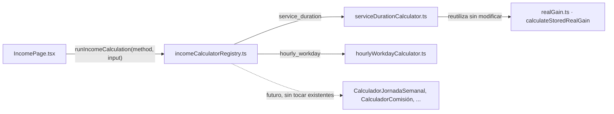
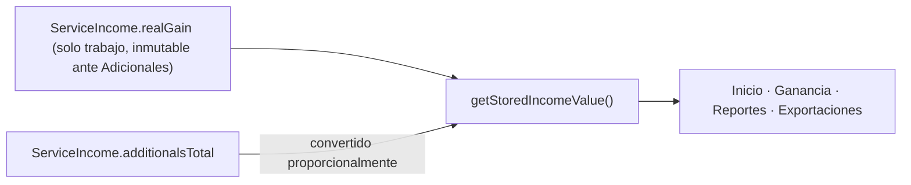

# 09 - Design Patterns

## 1) Local-First Core

Patrón: el libro financiero vive localmente y la app sigue operativa offline.

Aplicación:

- persistencia Dexie como fuente primaria;
- UI basada en lectura local inmediata;
- automatización desacoplada por outbox.

## 2) Outbox + Retry

Patrón: transacción local primero, envío remoto después.

Aplicación:

- eventos `income/expense/calendar` se guardan con el dato de negocio;
- reintentos escalonados ante fallas de red;
- idempotencia en servidor/workflow para evitar duplicados.

## 3) Fail-Closed

Patrón: ante duda o inconsistencia, bloquear y no degradar integridad.

Aplicación:

- validaciones de licencia/JWT/contratos en API;
- rechazo de snapshots/knowledge inconsistentes;
- estados `rejected/error` en dashboard insights;
- fallback controlado a legacy en adapter financiero.

## 4) Append-Only for Derived Artifacts

Patrón: no sobrescribir historial derivado; crear revisión nueva.

Aplicación:

- `financialSnapshots` y `knowledgeSnapshots`;
- hooks Dexie que impiden update/delete;
- trazabilidad por `supersedes*`.

## 5) Ports and Adapters

Patrón: fronteras explícitas entre dominios y adaptadores.

Aplicación:

- Runtime Adapter entre Knowledge y Insight Runtime;
- Execution Service como orquestador 7D;
- Read Models como frontera 7E para UI.

## 6) Composition Root

Patrón: ensamblar dependencias fuera de componentes presentacionales.

Aplicación:

- `insightDashboardComposition.ts` crea dependencias;
- UI recibe solo estado/proyección, no repositorios internos.

## 7) Feature Flag Controlado

Patrón: activación reversible por bandera explícita.

Aplicación:

- `VITE_FINANCIAL_ENGINE_HOME_ENABLED`
- `VITE_FINANCIAL_SNAPSHOT_SHADOW_ENABLED`
- `VITE_FINANCIAL_SNAPSHOT_HOME_ENABLED`
- `VITE_FINANCIAL_SNAPSHOT_REPORTS_ENABLED`
- `VITE_KNOWLEDGE_SHADOW_ENABLED`

## 8) Security-by-Design

Patrón: secretos y validaciones críticas fuera del cliente.

Aplicación:

- guardas de build para bloquear `VITE_*` sensibles;
- JWT temporal en memoria;
- credenciales n8n/Evolution solo server/workflow.

## 9) Anti-patrones explícitamente evitados

- canal WhatsApp global por recencia sin contexto;
- IA con escritura automática en finanzas;
- acoplar UI a repositorios internos de dominio;
- ejecutar lógica financiera crítica dentro de workflows n8n.

## 10) Strategy Pattern (Motor de cálculo de ingreso)

Patrón: cada método de cálculo del ingreso se implementa como una estrategia aislada e intercambiable, seleccionada por un único despachador.

Aplicación (PB-IS-0007, `src/utils/incomeCalculation/`):

- `types.ts` define el contrato común `IncomeCalculator` (`calculate(input) → { realGain, workedHours? }`). `realGain` es exclusivamente el importe del trabajo realizado — los Adicionales nunca son un input de este motor ni se suman aquí (ver sección "Adicionales" más abajo).
- `serviceDurationCalculator.ts` implementa "Servicio por tiempo" envolviendo `calculateStoredRealGain` (`src/utils/realGain.ts`) sin modificarla — la fórmula "sagrada" existente queda intacta.
- `hourlyWorkdayCalculator.ts` implementa "Jornada por horas" (horas trabajadas × valor por hora, sin aplicar el % de temporada) de forma completamente aislada, sin compartir código con la estrategia anterior.
- `incomeCalculatorRegistry.ts` (`runIncomeCalculation`) es el único punto de despacho: resuelve el método, valida el input y delega en la estrategia correspondiente. Ningún otro archivo de la aplicación contiene un `if (method === ...)` de cálculo.

Beneficio explícito (Open/Closed, ya anticipado por el ticket): incorporar un método nuevo (jornada diaria/semanal/mensual, comisión, proyecto, honorarios) requiere únicamente agregar un archivo `xCalculator.ts` que implemente `IncomeCalculator` y registrarlo en `incomeCalculatorRegistry.ts` — nunca modificar las estrategias existentes.

### 10.1) Adicionales — agregación en un único punto, nunca en el registro (D-012)

Los Adicionales **no** son un input del motor de cálculo ni se suman a `realGain`/`totalAmount` del ingreso, ni al crearlo ni después. `additionalsTotal` es el único campo que se mantiene al día en el registro (`incomeAdditionalService.ts`); el resto del ingreso permanece inalterado por completo.

`getStoredIncomeValue` (`src/utils/financeStats.ts`) es el único punto donde ambos se suman, exclusivamente para agregados de balance — nunca se persiste ese resultado combinado sobre el ingreso individual.
